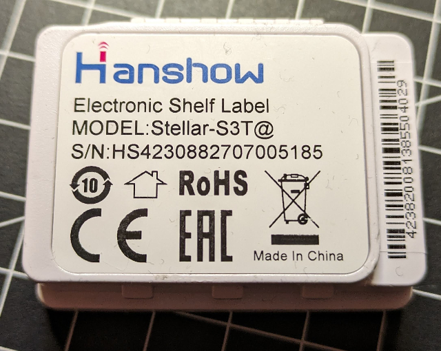
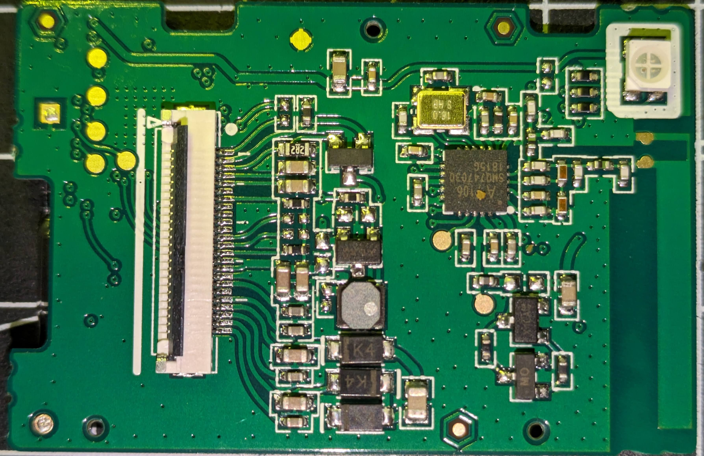
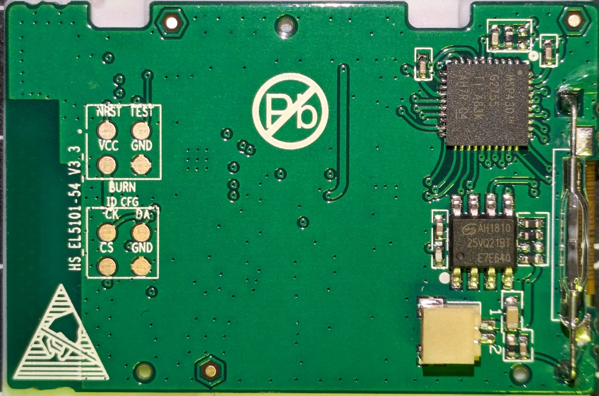

# Hacking away on the Hanshow Stellar-S3T@ Electronic Shelf Label

After [hacking the Hanshow Stellar M3@](Readme-m3.md) this device seems to be quite similar.

To open the device, remove the battery from the back, then slide an exacto knife or similar between the translucent display cover and the case. Be careful not to damage the display.

Opening the device revealed the following:
  
- 3V supplied by CR2477 cell (dead)  
- PCB version: `HS_EL5101-54_V3_3`
- MCU: `TI MSP430G2755`  
- Wireless chip: `A7106`
- SPI flash: `AH1819 25VQ21BT` - 2Mbit/256kB
- Display Module: [Good Display 1.54 inch e-paper module](https://www.good-display.com/product/1.54-inch-e-paper-display-module-partial-refresh-E-ink-screen,-GDEH0154D67-208.html) partial refresh E-ink module, [GDEH0154D67](https://v4.cecdn.yun300.cn/100001_1909185148/GDEH0154D67-0111.pdf)
  - 200x200  Holitech Hink-E0154A07-A1 B/W/R display
  - Controller seems to be [SSD1681](https://files.seeedstudio.com/wiki/Other_Display/154-epaper/IC%20Driver%20SSD1681.pdf)

The PCB has more than 2 layers so tracing connections is difficult. Also, traces are hidden by parts and connectors.

## GPIO

Seems to be the same pinout as the M3 so far.

## Accessing the MCU
 
This time a cheap TI Launchpad board was used to get access to the MCU, utilizing the 'spy-bi-wire' interface.
Hook up Vcc, Gnc, RSTn and Test to the four pads labeled accordingly.
Luckily the JTAG fuse was not blown so the existing firmware can be saved for further analysis.

`(mspdebug) save_raw 0x8000 0x8000 hanshow.bin`

## Firmware analysis

A quick and easy disassembly can be done via

 `msp430-objdump -D  -m msp430 -b binary --adjust-vma=0x8000 hanshow.bin > hanshow.dis`

However, using Ghidra is much more convenient.

## Compiling & uploading

`make main` to just compile
`make upload-sbw` to compile and upload