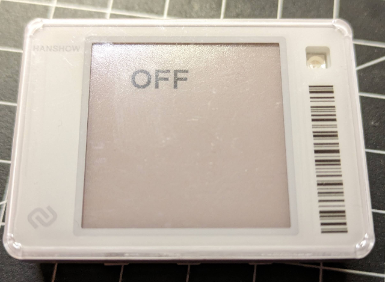

# Hacking away on Hanshow Electronic Shelf Lables (baseed on the TI MSP430G2775 MCU)

This is about getting you own baremetal code running on two very similar e-paper based ESLs:

- [Hanshow Stallar M3@](Readme-m3.md) - This is where it started, using serial Boot Strap Loader access.

- [Hanshow Stellar ST3](Readme-st3.md) - Based on the findings above, using spy-bi-wire/JTAG access.

## Open points / unclear

- Haven't touched the radio yet
- Initialization of epd needs 0xf7 in initial power-up for display update control 2 command (0x22). Most other epd code sources rely on 0xc4 or 0xc7 (which also works on the succeeding updates)
- ST3 display with 200x200 would need 5kB for framebuffer operation, which is obviously not going to work
- Using Spy-bi-wire as UART backchannel - Don't know if that is possible at all

