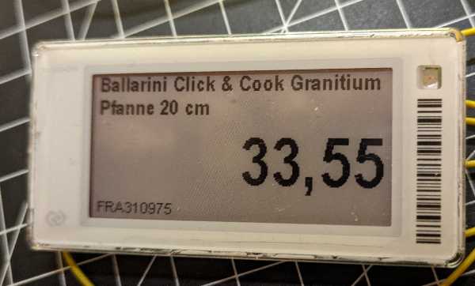
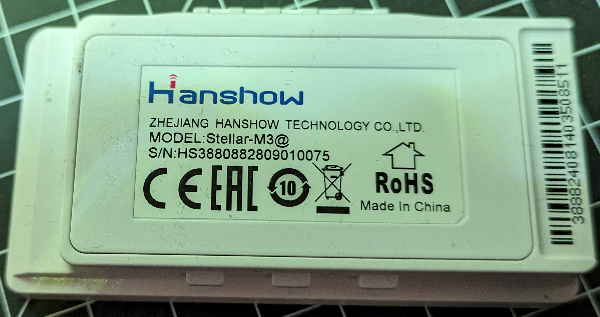
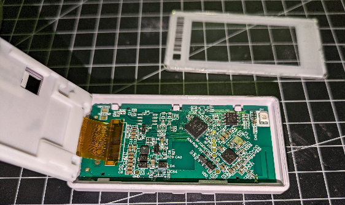
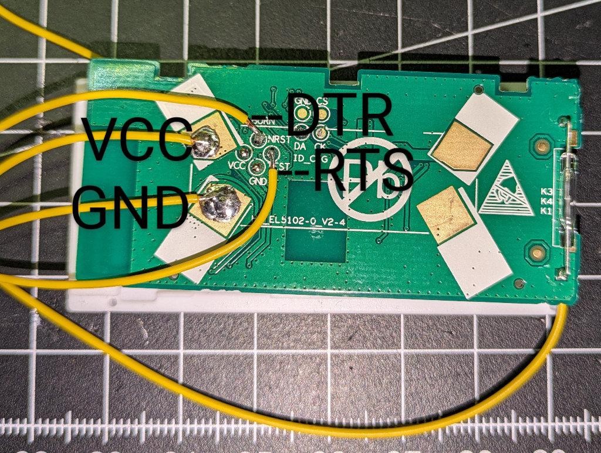
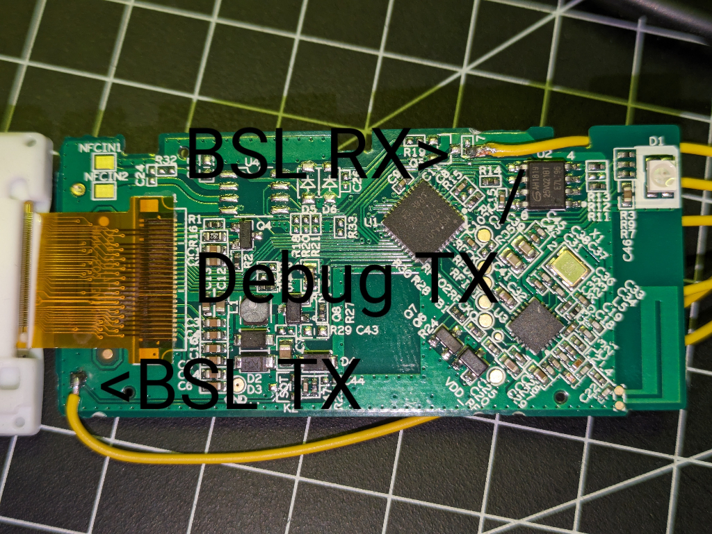

# Hacking away on the Hanshow Stellar-M3@ Electronic Shelf Label

I bought a used e-paper based electronic shelf label from the company "Hanshow" marked `MODEL: Stellar-M3@`. 

To open the device, remove the battery from the back, then slide an exacto knife or similar between the translucent display cover and the case. Be careful not to damage the display.

Opening the device revealed the following:
  
- 3V supplied by 2 CR2450 cells (dead)  
- PCB version: `HS_EL5102-0_V2-4`
- MCU: TI `MSP430G2755` 
- Wireless chip: `A7106`
- SPI flash: `AH1819 25VQ21BT` - 2Mbit/256kB
- Display: 2.13" 250x150 1bit EPD (Waveshare, SSD1673A/IL3895 based?)
- Reed contact connected to P1.1 

## MCU Connection via Bootstrap Loader (BSL)

### Physical connection

In order to get a connection to the MCU the uart mode of the BSL is used. A couple of testpoints on the battery side came in handy. 

| Module | Location | RS-232 |
|--------|----|-------|
| `Vcc` | test point battery case | 3.3V |
| `GND` | test point battery case | GND   |
| `Test` | test point battery case | RTS | 
| `nRST` | test point batter case | DTR |
| BSL TX on `P1.1` | P1.1 is routed to the reed switch | RX |
| BSL RX on `P2.2` | P2.2 is routed to R17 which is unpopulated | TX |

I am using a CP2102 based USB to serial converter module.

### Software Access to the MCU

Install a recent version of `mspdebug` (0.25).

To enter BSL mode Test/nRST have to be toggled in a specific way. Refer to https://www.ti.com/lit/pdf/slau319. This can be controlled by mspdebug.

The only way to get access to flash memory is to execute a "mass erase" command, that will unlock the flash and delete all contents (including the calibration data of the internal clock unit as well as the ADC calibration).

Initiate mass erase (adjust serial port accordingly):

`mspdebug -d /dev/ttyUSB0 rom-bsl --bsl-entry-sequence Dr,R,r,R,r,d`

### Compile and upload code

- Download the TI MSP430-GCC from https://www.ti.com/tool/MSP430-GCC-OPENSOURCE#downloads
- Adjust `PROG_PORT` and `MSPDIR` in `src/Makefile`
- Execute `make`

# Hardware Findings

## GPIO

| Port | Pin  | Connection |
|------|------|------------|
| P1.0 | 29   | EPD: power? |
| P1.1 | 30   | reed switch, BSL TX  |
| P1.2 | 31   | LED green |
| P1.3 | 32   ||
| P1.4 | 33   ||
| P1.5 | 34   ||
| P1.6 | 35   ||
| P1.7 | 36   ||
| P2.0 | 6    | LED blue |
| P2.1 | 7    | |
| P2.2 | 8    | BSL RX |
| P2.3 | 27   | EPD: CLK |
| P2.4 | 28   | EPD: DIN |
| P2.5 | 40   ||
| P2.6 | 3    ||
| P2.7 | 2    ||
| P3.0 | 9    ||
| P3.1 | 10   ||
| P3.2 | 11   ||
| P3.3 | 12   || 
| P3.4 | 23   | SPI Flash: SI / UART TX |
| P3.5 | 24   ||
| P3.6 | 25   | EPD: D/Cn |
| P3.7 | 26   | EPD: CSn |
| P4.0 | 15   | LED red  |
| P4.1 | 16   | |
| P4.2 | 17   ||
| P4.3 | 18   ||
| P4.4 | 19   | (EPD: HLT?) |
| P4.5 | 20   | EPD: BS |
| P4.6 | 21   | EPD: BUSYn |
| P4.7 | 22   | EPD: RSTn |

## Serial port

Using the built in UART to get some debugging output on P3.4. This pin is conveniently routed to pin 5 of the SPI flash where a micro clamp can be easily connected to a second USB to serial adapter module.

As the calibration data of the digital controlled oscillator (DCO) has been erased during the mass erase, the intneral clock will run slightly faster therefore configuring the UART needed some tweeking (see code).

# References

- https://github.com/CursedHardware/hanshow/blob/master/HS_EL5101.md
- https://www.ti.com/product/MSP430G2755 - Datasheet 
- https://www.ti.com/lit/pdf/slau144 - User's Guide
- https://www.ti.com/lit/pdf/slau319 - TI BSL User's Guide
